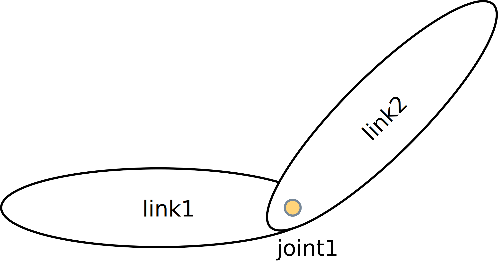
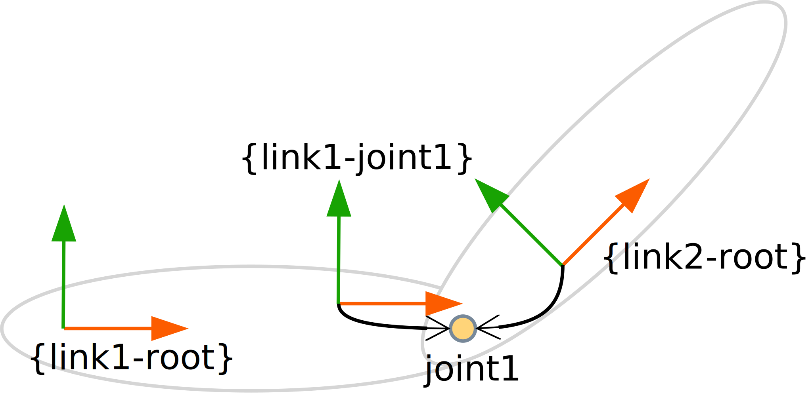
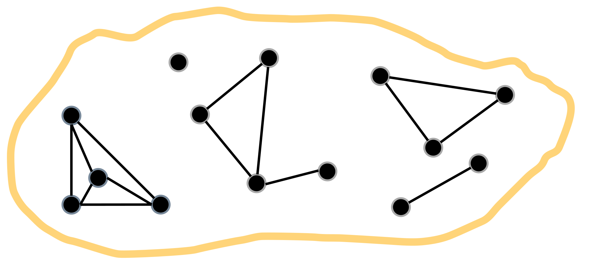
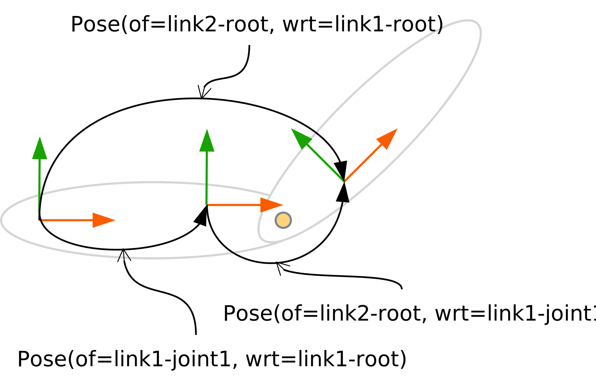
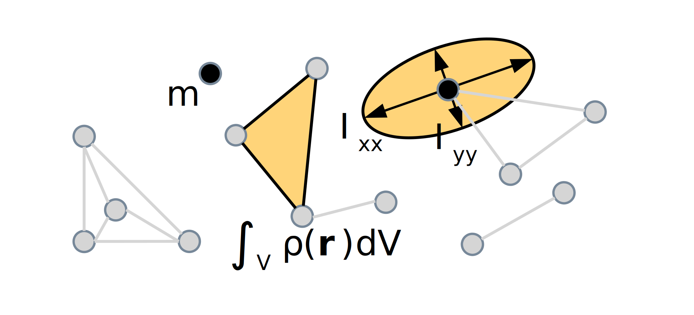

# Composable robot models - A modelling tutorial for kinematic chains and their behaviour

## Introduction
The objective of this tutorial is to demonstrate how to create composable
models for robots. Here, we focus on a simple kinematic chain with one degree of
freedom (DoF) because (i) kinematic chains are the smallest viable world models
that robots employ and hence go beyond toy examples; (ii) they provide many
building blocks that are also relevant for other domains; (iii) they demonstrate
the challenges in modelling and how to address them with composable models; and
(iv) kinematic chains with more than one DoF are structurally very similar to
the 1-DoF chain.

The following figure (Figure 1) depicts the kinematic chain example that we will
study below. It consists of the two links `link1` and `link2` as well as the
revolute joint `joint1`.

|  |
|:-------------------------------------------:|
|      Figure 1: Kinematic chain example      |

### JSON-LD
Here we choose to represent our models and metamodels with
[JSON-LD](https://www.w3.org/TR/json-ld/). JSON-LD is a W3C standard to encode
linked data in JSON and hence, it bridges between the widely-used JSON format
and the [Semantic Web](https://www.w3.org/standards/semanticweb/) with all its
established tools.

JSON-LD introduces several keywords that recur in the models so that we briefly
explain them here. First, each model can be identified by and identifier, an
Internationalized Resource Identifier (IRI), with the `@id` property. Second,
one or more types (also IRIs) can be associated to a model by using the `@type`
property. Third, `@context` indicates a context which describes the mapping
between the JSON world and the Semantic Web world. In other words, the context
defines the metamodels that a model conforms to. Common contexts or elements
can be hoisted out of a model to a composition model (e.g. the "document root").
Finally, a graph can be reified using the `@graph` keyword.

## Skeleton
The first step is to create the "[skeleton](models/skeleton.json)" or "stick
figure" for the bodies in the kinematic chain. By skeleton we mean the bare
minimum structure to which we attach further models. Here, the skeleton consists
of points, vectors and frames as shown in the following diagram (Figure 2). The
arrows indicate that the origins of both frames coincide, but for better
readability both frames are spatially separated in the figure.

|                      |
|:-------------------------------------------------:|
| Figure 2: Skeleton of the kinematic chain example |

Note that the links' spatial extent or shape is not part of the skeleton.
Instead it is one of the possible attachements to entities in the skeleton. All
attachments, some of them discussed below, are independent of each other and
only refer to the common elements defined in the "skeleton".

### Point
The point is the most primitive entity in any space. In the context of robotics
the objectives of points are multi-fold. They are the building block of further
geometric entities e.g. line segments, vectors or frames as we will see below.
Points also play various roles in encoding spatial relations or dynamic
quantities. For instance, they are required to define positions or they
represent the point of observation/measurement for twists and wrenches.

The following example shows a point - that is meant to represent the origin of
the "link1-joint1" frame - that lives in 3D Euclidean space as indicated by its
type. As (Euclidean) space consists of an inifinite amount of points, the
interpretation of this model is that it designates one particular of those
points.

```JSON
{
    "@id": "rob:link1-joint1-origin",
    "@type": [ "3D", "Euclidean", "Point" ]
}
```

The types `3D`, `Euclidean` and `Point` are examples of what we call semantic
constraints in that they implicitly encode constraints (that can however be
looked up in the definition of the type). This contrasts with structural
constraints which define a specific representation of a model and allow checking
for well-formedness in terms of the presence or absence of certain properties in
that model.

Additionally, the three types in the above model demonstrate multi-conformance.
That means that a model can conform to more than one metamodel or type. This is
a feature that lacks in many established model-driven engineering approaches.
Also note that in the step from JSON to JSON-LD all strings in the type array
get converted to IRIs so that one can choose to look up their meaning.

### Vector
Euclidean space distinguishes two types of vectors:

- Free vectors that possess only a direction and a magnitude.
- Bound vectors that are composition relations between two Euclidean points (the
  start and end point). Bound vectors are also vectors and hence possess a
  direction and magnitude.

The following model exemplifies a bound vector that will represent the
x-direction of the "link1-joint1" frame. Hence, we also impose the constraint
that it should be of unit length (this constraint is valid only in metric spaces 
such as Euclidean space). Also note that we omit the end point because here it
is not relevant to the application.

```JSON
{
    "@id": "rob:link1-joint1-x",
    "@type": [ "3D", "Euclidean", "Vector",
               "BoundVector", "UnitLength" ],
    "start": "rob:link1-joint1-origin"
}
```
Similar to the [previous example](#point), neither the `Vector` type nor the
`UnitLength` type impose a structural constraint. However, the `BoundVector` has
an impact on the structure of the model in that it does require the `start`
property to be present. The metamodel defines the `start` property to be a
symbolic pointer (an IRI) and the model shown here lets it refer to the point
defined in the previous example.

### Frame
A frame (of reference) in Euclidean space is an attachment point for orientation
or pose specifications. In $n$-dimensional space it can be represented by $n+1$
non-coplanar points (a simplex) or by $n$ vectors that all share a common start
point. All points are constrained to remain at a fixed distance which means that
a frame is the most simple rigid body. Moreover, we will work with orthonormal
frames which means that all vectors are of unit length and form right angles
with respect to each other. In three-dimensional space a frame also indicates
orientation or handedness, i.e. a frame can either be left-handed or
right-handed.

The model below exemplifies the frame "link1-joint1" which represents the
attachment point of "joint1" on the first link. Additionally, in this model we
chose to structurally represent the frame with the `OriginVectorsXYZ` type which
requires the `origin` property that points to the common start point of the
vectors and the three properties that represent the vectors themselves with the
names `vector-x`, `vector-y` and `vector-z` as defined by the type.

```JSON
{
    "@id": "rob:link1-joint1",
    "@type": [ "3D", "Euclidean", "Frame", "RigidBody",
               "Orthonormal", "RightHanded",
               "OriginVectorsXYZ" ],
    "origin": "rob:link1-joint1-origin",
    "vector-x": "rob:link1-joint1-x",
    "vector-y": "rob:link1-joint1-y",
    "vector-z": "rob:link1-joint1-z"
}
```

We notice that the `OriginVectorsXYZ` forces the names of the vectors to be x, y
and z. But this is just a choice, albeit a common one. Other conventions to
denominate the vectors are $x_0$, $x_1$ and $x_2$ or just represent them as an
ordered list. To support such further representations a different type
(potentially originating from another metamodel) would be required.

Another objective of frames is to map geometric entities such as points or
vectors to their coordinate representation i.e. they define coordinate systems
as we will discuss [below](#coordinates).

### Simplicial complex
With the above geometric entities instantiated, we can now model the first part
of a link: it is simply a collection of all those entities that are part of the
link. In accordance with mathematics we call this composition structure a
simplicial complex as illustrated in the following diagram (Figure 3).

|                                       |
|:--------------------------------------------------------------------------------------:|
| Figure 3: Graphical illustration of a simplicial complex as a collection of simplicies |

In three dimensions it can consist of points, line segments, triangles ("2D
frames") and tetrahedra ("3D frames") which are the 0-, 1-, 2- and 3-dimensional
simplices, respectively. Since the simplicial complex is a transitive relation
all constituents of the simplices will be part of the simplicial complex, too.
The following model shows the simplicial complex associated with "link1".

```JSON
{
    "@id": "rob:link1",
    "@type": [ "SimplicialComplex", "RigidBody" ],
    "simplices": [
        "rob:link1-root",
        "rob:link1-joint1",
        "rob:link1-joint1-origin",
        "rob:link1-joint1-x",
        "rob:link1-joint1-y",
        "rob:link1-joint1-z"
    ]
}
```

This example also imposes a rigid-body constraint on the simplicial complex
to model that no relative motion occurs between any of the simplices, i.e. the
material exhibits infinite stiffness. While not yet implemented here, our
modelling approach is also open to support soft bodies where the relative motion
between some or all simplices is described by constitutive equations that
characterize mechanical material properties. The rigid-body is indeed one of the
most simple constitutive equations.

The simplicial complex with a rigid-body constraint is commonly used to simplify
numeric computations that solve the equations of motion for complex mechanisms
because it enables a simplified representation of inertia. Such a lumped
parameter representation will be attached to a link in the discussion of
[dynamics](#dynamics) below.

## Spatial relations
The first type of "declarative" spatial relations defined in the
[spatial relations model](models/spatial-relations.json) represents the
collinearity of two lines or rather vectors. Namely, the z-vectors of the
link1-joint" and "link2-root" frames. The reason for this constraint relation is
that a revolute joint requires a common axis that is fixed to both rigid bodies
and around which the rotation occurs. The following model exemplifies this
constraint for "joint1".

```JSON
{
    "@id": "rob:joint1-common-axis",
    "@type": "LineCollinearity",
    "lines": [
        "rob:link1-joint1-z",
        "rob:link2-root-z"
    ]
}
```

The second type of "imperative" spatial relations comprises the position, in its
linear, angular and composite version as well as its first- and second-order
time derivatives of velocity and acceleration, respectively. The following
diagram (Figure 4) depicts the three pose relations (i.e. the composition of
positions and orientations represented as an arrow with a solid head) that are
of interest in the kinematic chain example.

|    |
|:-------------------------------------------------:|
| Figure 4: Pose relations attached to the skeleton |

The lower-left pose crosses the link, the lower-right pose crosses the joint and
the upper pose is the composition of the two previous poses. The following model
exemplifies the textual representation of the former pose. A pose relates two
frames which we call the `of` frame and the `with-respect-to` frame. An
additional property of every position-based spatial relation is the quantity
kind as used in dimensional analysis. Here, we reuse the
[QUDT](#https://www.qudt.org/) ontology to represent quantity kinds. For any
pose there will always be two quantity kinds, namely the `Angle` to represent
the orientation part of the pose and the `Length` to represent the position
part.

```JSON
{
    "@id": "rob:pose-link1-joint1-wrt-link1-root",
    "@type": "Pose",
    "of": "rob:link1-joint1",
    "with-respect-to": "rob:link1-root",
    "quantity-kind": [ "Angle", "Length" ]
}
```

A pose is sufficient to describe the relative position of any two points that
belong to two different rigid bodies. Hence, even if the pose only relates two
frames it follows that it also characterizes the pose between the rigid bodies
(or simplicial complices) that those frames are a part of.

By separating the pose from the frames which it relates, we enable a modeller to
associate multiple poses with a frame. This is a more faithful representation of
poses than treating them as properties of frames as is often found in
state-of-the-art modelling approaches. However, it also allows to create cycles
of poses. Whenever such a situation occurs, the poses accumulated along each
path in the cycle must be consistent. While we have chosen the pose as an
example, all arguments in this paragraph hold for any spatial relation.

### Coordinates
To perform computations a numeric representation of the spatial relations is
required as shown in the [model](models/cartesian-coordinates.json) for
Cartesian coordinates.

The following example shows the coordinates for the pose across the "link1".
Since that pose remains static, its coordinates can be provided during the
robot's design, for example, by a robot manufacturer. For poses across motion
constraints such as joints the concrete coordinate values will most likely only
be available during the robot's runtime and will be acquired by some sensor.

```JSON
{
    "@id": "rob:pose-link1-joint1-wrt-link1-root-coord",
    "@type": [ "3D", "Euclidean", "PoseReference", 
               "PoseCoordinate", "DirectionCosineXYZ",
               "VectorXYZ" ],
    "of-pose": "rob:pose-link1-joint1-wrt-link1-root",
    "as-seen-by": "rob:link1-root",
    "unit": [ "UNITLESS", "M" ],
    "direction-cosine-x": [ 0.0, 0.0, 1.0 ],
    "direction-cosine-y": [ 0.0, 1.0, 0.0 ],
    "direction-cosine-z": [ 1.0, 0.0, 0.0 ],
    "x": 1.0,
    "y": 2.0,
    "z": 3.0
}
```

The model represents Cartesian coordinates, hence the `Euclidean` type.
Moreover, it references the previously defined pose relation via the `of-pose`
property as required by the `PoseReference` structural constraint. A different
option (not shown in the example) is to directly embed the coordinate
representation into the pose relation. This, however, is in general not
advisable because the same physical pose can be represented by an infinite
amount of coordinate representations, i.e. spatial relations are properties of
coordinate representations but not vice versa. The next property required by any
coordinate representation is the coordinate system that the spatial relation is
measured or expressed in as represented by the `as-seen-by` symbolic pointer.
Additionally, coordinates must be accompanied by a `unit` of measurement which
must conform to and complements the quantity kind in the spatial relation.
Finally, in the model above we choose to represent the pose by three direction
cosines, the columns of the rotation matrix, and a vector with the entries named
as x, y and z.

A wide range of coordinate representations of positions, orientations and poses
exist such as cylindrical, spherical or projective/homogeneous coordinates, all
of which require their own model and metamodel representations. Similarly,
velocity and acceleration representations demand for further metamodels.
Discussing those is out of scope for this document, though.

## Dynamics
The equations of motion for mechanical systems are of second-order, i.e. the
Newton-Euler equations for a rigid body relate acceleration and force via the
body's inertia. Hence, for solving those equations a specification of the
inertia is required as shown in the [dynamics model](model/dynamics.json).

The following diagram (Figure 5) graphically represents three types of inertia
attachments: a point mass $m$, a rotational inertia modelled by the principal
moments of inertia $I_{xx}$ and $I_{yy}$ as well as a density over a volume
$\int_V \rho(\vec{r})dV$.

|  |
|:-------------------------------------------------:|
|      Figure 5: Different inertia attachments      |

The textual model below gives an example of an inertia attachment to the second
link in the kinematic chain. The so-called rigid-body inertia composes linear
inertia (mass) and rotational inertia into the same model. While this inertia
specification is attached to a rigid body via the `of-body` property we chose to
merge the coordinate-free representation with the coordinates. The
coordinate-free version of rotational inertia requires a `reference-point`
property and an invariant `quantity-kind` of `MomentOfInertia`. Here, the
coordinates are then expressed in units of $[kg \cdot m^2]$ with respect to the
`as-seen-by` frame that references the second link's root frame and plays the
role of a coordinate system. Three properties, namely `xx`, `yy` and `zz`
represent the concrete values. A similar representation is used for mass, it is
just independent of a reference point or coordinate frame.

```JSON
{
    "@id": "rob:link2-inertia",
    "@type": [ "RigidBodyInertia", "Mass",
               "RotationalInertia",
               "PrincipalMomentsOfInertiaXYZ" ],
    "of-body": "rob:link2",
    "reference-point": "rob:link2-root-origin",
    "as-seen-by": "rob:link2-root",
    "quantity-kind": [ "MomentOfInertia", "Mass" ],
    "unit": [ "KiloGM-M2", "KiloGM" ],
    "xx": 0.1,
    "yy": 0.1,
    "zz": 0.1,
    "mass": 1.0
}
```

## Kinematic chain
The [kinematic chain model](models/chain.json) shows two types of motion
constraints. The joint is the most simple motion constraint between attachments
such as frames on two bodies. In the following example we recognize this by the
`between-attachments` property. More specifically the joint is a revolute joint
as already mentioned before. Hence, two more properties are required: the
`common-axis` around which the relative motion occurs and the `origin-offset`
that defines the distance or position of the two frames' origins along the
common axis.
```JSON
{
    "@id": "rob:joint1",
    "@type": [ "Joint", "RevoluteJoint" ],
    "between-attachments": [
        "rob:link1-joint1",
        "rob:link2-root"
    ],
    "common-axis": "rob:joint1-common-axis",
    "origin-offset": "rob:joint1-offset"
}
```

The kinematic chain is a composite motion constraint with a set of joints as its
property as seen below. For the 1-DoF example obviously only one joint is
required. The kinematic chain imposes a semantic constraint that all referenced
joints must be part of the same graph.
```JSON
{
    "@id": "rob:kin-chain1",
    "@type": "KinematicChain",
    "joints": [ "rob:joint1" ]
}
```

### Coordinates
For a real robot the joint configuration can often, but not always, be directly
acquired from sensors such as encoders associated with a joint. The model of
such a sensor would be a higher-order relation that refers to the same
attachments that are also used by the joint. In this tutorial however, we rely
on a fixed value to represent the joint position as realized by the
[joint coordinates model](models/joint-coordinates.json).

## Acknowledgement

This work is part of a project that has received funding from the European
Union's Horizon 2020 research and innovation programme SESAME under grant
agreement No 101017258.

<p align="center">
  
  
</p>
